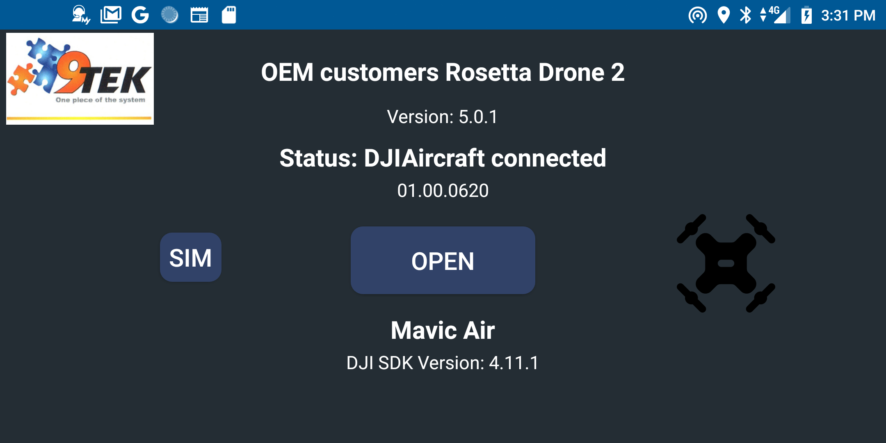
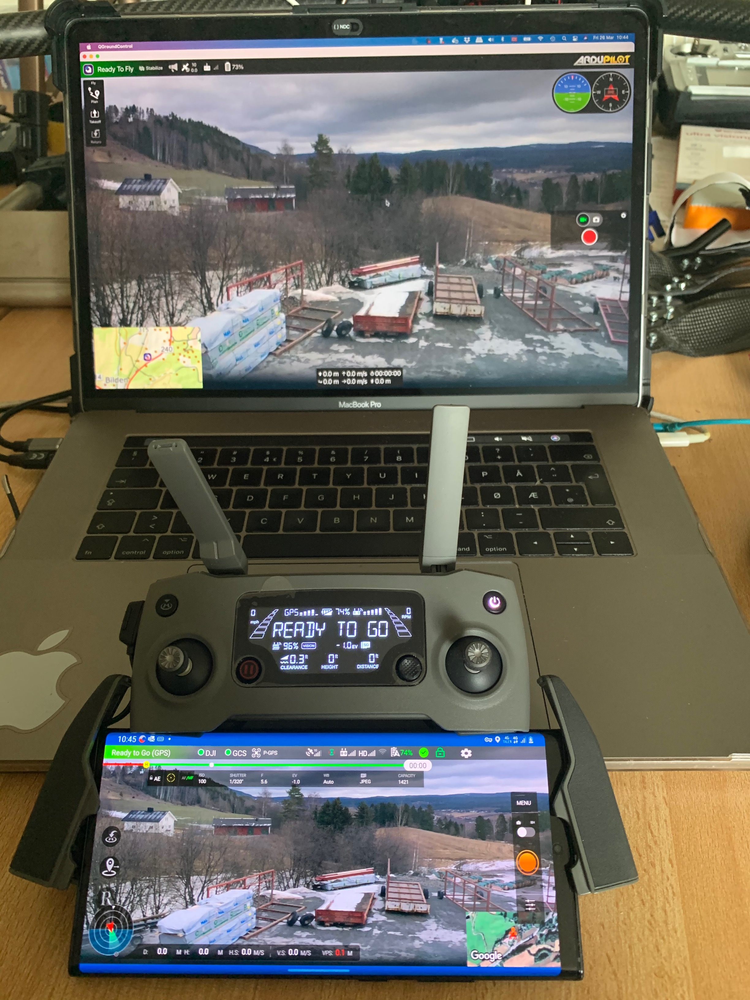
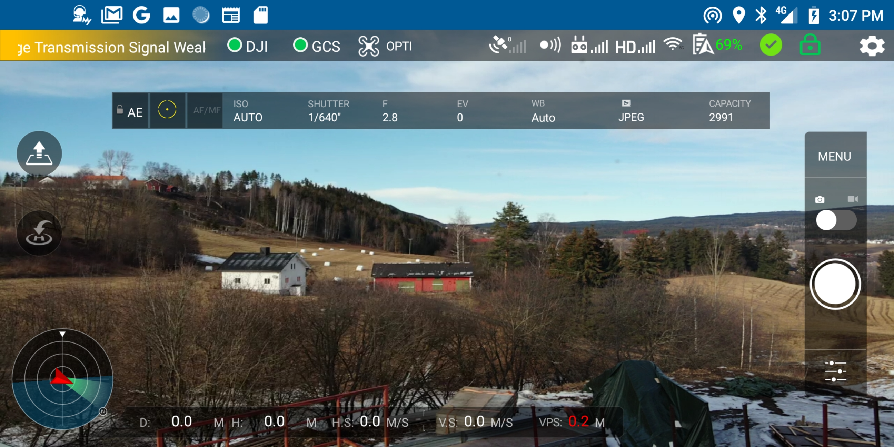

# Welcome to Rosetta Drone

This is the official and active maintained Rosetta Drone.

Rosetta Drone is a MAVLink wrapper for the DJI SDK, which allows users to fly DJI drones using MAVLink-speaking ground control stations. In theory it should work with any MAVLink GCS.

*** IMPORTANT SAFETY NOTE ***

Stay always away from the propellers. Use Rosetta Drone's "Safe Mode" to prevent the drone from unexpectly arming or taking off.
When testing a new Rosetta version, test it first using the simulator.

This Software is experimental and under constant development. By using this Software, you agree to assume all responsibility for eventual harm or damage.
See "Known issues" below before use.


## What's New

This new version implements a MissionManager that speaks native MAVLink and uses VirtualSticks to support the DJI Mini series and other DJI drones without on-board waypoint missions.

The MissionManager can also be used with DJI drones that support WayPoints and MissionControl onboard. 
This can be an interesting alternative for improving the features offerd by their flightcontrollers.


## Supported Drones

Rosetta has been tested on:
* DJI Mini
* DJI Mini SE
* DJI Mini 2
* DJI Mini 2 SE
* DJI Air
* Mavic 2
* Mavic Pro
* Mavic AIR series
* Matrice 210 V2

Rosetta is compatible with:
* QGroundControl
* Mission Planer
* ArduCopter SITL
* Dronekit-Python (AI scripting)
* MavProxy
* MAVSDK
* DJI SDK 4.16.1

## Hacking on Rosetta

* If you want to contribute, please check this [important recomendations](https://docs.google.com/document/d/1wR56Mvd2OsT82kxMOD7f_3-c6yJGBtLaT8LuVrmC5wI/edit?usp=sharing).
* Here is some [documentation](https://github.com/lilfish/Delta-FlowerPower/wiki/Drone-app) from a forked project.
* Rosetta can be tested without a Drone (press 5 times on the logo). For MAVLink and GUI testing.

### **Please create issues and PR on this fork.** 


Opening screen, requires DJI login first time...
  
This version has implemented the new video stream method in DJI SDK that require quite a few modifications. It also includes all the latest libraries, and Androidx.
In the unstable code there is also the DJI simulator, to enable testing in the lab. Android Studio is now updated to 3.6

# Screenshots


DJI-Rosettadrone-QGC live over 4G-LTE


Main screen, with live video on Mavic AIR (from my office)...


Main screen on QGroundControl with live video and telemetry... (from inside my office)


Rosetta Drone 2 on the big screen from DJI Smart Controller


Rosetta Drone 2 on the DJI Smart Controller

Latency video: 

(https://youtu.be/HAC5OpQQpDI "Click to play in Youtube.com")

# Features

* Report telemetry in QGC like position, attitude, relative altitude, heading, and battery remaining
* Command Return-to-Launch from QGC
* View drone video feeds in QGC or forward RTP to an IP address of your choice (currently Mavic Pro 2 only)
* Create and fly waypoint missions (with and without VirtualSticks)
* Fly by joystick and QGS
* Fly from Python in DroneKit
* Use Mavproxy to connect both QGC and DroneKit at the same time
* Use Gstreamer/OpenCV/FFMPEG and DroneKit to create complex AI functions


# Usage

## Setup (QGroundControl)

1. Connect your Android phone to a DJI transmitter and power on your DJI drone.

2. Start Rosetta Drone. The DJI light in the top-right will turn green if the app is successfully communicating with your drone.

3. If you wish to use QGroundControl on an external device, click the Gear icon to access Settings, check **Use GCS on an external device**, then specify an IP address.
Additionally a second telemetry connection con be configured to run AI scripts using DroneKit Python.

4. Start QGroundControl. A telemetry connection should be immediately established, and the GCS light in Rosetta Drone will turn green. 
Note that if you are using QGroundControl on the same device as Rosetta drone, the GCS light may not turn green if QGC is in the background. 

5. To start video:

    a. Click the "Q" icon in the top-left corner of QGC
    
    b. Under **Video** change **Video Source** to **UDP Video Stream**.
    
    c. Change **UDP Port** to 5600.

6. Takeoff is recommended using the RC transmitter. To arm or takeoff from the GCS, click the **SAFETY ENABLED** button. It will turn green and say **READY TO FLY**. Then use the QGroundControl **Takeoff** or **Start Mission** function.
Takeoff and missions should also work fine using QGC.

7. After flight, ensure Safe Mode is enabled before approaching propellers.

8. Support is added for Pan and Tilt of camera gimbal by using RC channel 8 and 9.

### Add this to you're Dronekit python script:

def set_servo(servo,val):
    msg = vehicle.message_factory.command_long_encode(
            0, # time_boot_ms (not used)
            0,  # target system, target component
            mavutil.mavlink.MAV_CMD_DO_SET_SERVO, 
            0, 
            servo, # RC channel...
            1500+(val*5.5), # RC value
            0, 0, 0, 0, 0)
    vehicle.send_mavlink(msg)
    vehicle.flush()
    
    And then use: set_servo(8,-45.0) to set the gimbal....

9. Support for **joystick** is added and tested with QGroundcontrol, using the now built in simulator.

10. By taping on the drone icon 5 times, you enable test mode and can open the software with no drone connected. Useful for testing MAVLink communication and GUI.

    
# Building from source

1. Install git lfs as specified at https://github.com/git-lfs/git-lfs/wiki/Installation

2. Clone or download the repository.

3. In Android Studio, select **File->New->Import Project** and navigate to the downloaded folder.
 
4. Sign up for the DJI Developer Program at https://developer.dji.com/mobile-sdk/ and create an Application key. The package name should be sq.rogue.rosettadrone.

5. Generate Google Maps API key using instructions at https://developers.google.com/maps/documentation/javascript/get-api-key#creating-api-keys 
 
6. Create a new file called keys.xml in the /app/src/main/res/values/ folder, and insert the following:
    ```
    <?xml version="1.0" encoding="utf-8"?>
    <resources>
        <string name="dji_key">INSERT KEY HERE</string>
        <string name="google_key">INSERT KEY HERE</string>
    </resources>
    ```
    
7. Run **Build->Make Project**


# DJI-Mavlink Translation Notes

Anyone who speaks multiple languages knows that translations are rarely perfect. The same is the case here.

- The **ARM** button in QGC does not work, by design. Sending a "Takeoff" or "Start Mission" command from QGC will arm the motors and takeoff.

- DJI reports heading in True, which Rosetta passes along in vfr_hud.hdg. The mavlink protocol does not specify magnetic or true.

- DJI and Mavlink use different scales to characterise GPS accuracy. DJI also does not report hdop or vdop.

- Radio signal strength is not yet implemented

- Rosetta drone 2 reports groundspeed and airspeed as the same, and does no wind correction

- There is currently no way to turn the video camera on or off in QGC, but DJI controllers will still work fine, Mavlink support for this is now added.

- The only implemented waypoint actions include delaying at a waypoint, taking a photo, or changing the gimbal pitch

- Battery % is now show in the GUI on the main screen.

- Battery Warnings for both Drone and Controller at 20% 10% and 5%. No sound as the moment.

- Controller stick positions and C1, C2 and C3 switch states are now reported as RC RAW messages over Mavlink

- A working DJI simulator is added for testing and training. The simulator is Hardware In the Loop (HIL), and this require both a controller and a drone connected. 

- A test mode is added by hitting 5 times on the drone icon. This will enable GUI testing only. 

- The message on the boot/login screen can now be modified in "settings/drone configuration/App Name" , to make tha app more private. 

- The switch C3 is now both reported as switch 3 and also performa a auto takeoff is the system is armed. This to allow flying from Rosetta Drone 2, might be reverted.


# Known Issues for Users

- If you change the UDP port while QGC is running, you may need to restart QGC.

- If you change the video UDP port while QGC is running, you may need to restart Rosetta drone 2

- Some times the Rosetta Drone 2 stopps and restarts, work are in progress to eliminate this. Seems to be related to the Mavlik layer.

- If you takeoff using the QGC, and then sett a point and hit goto, the Rosetta drone 2 enters an error state. Work are in progress. 


# Known Issues for Developers

RosettaDrone 2 uses MAVLink code generated by the MAVLink code generator, using the ArduPilot dialect. The Java code generator contains errors (see issues [#805](https://github.com/mavlink/mavlink/issues/805) and [#806](https://github.com/mavlink/mavlink/issues/806)), and the code required manual tweaking after generation. This means that simply dropping in updated auto-generated files will likely produce errors. At the moment this seems only to apply for setting and getting double that is missing. It is quite easy to copy the float function and modify it to double. The only usage for this is for ROV wheel distance, so someone should fix that in Mavlink. 

The use of an ArduPilot dialect over PX4 is not intended to be a statement of preference. The author believes strongly in the importance of maintaining maximum compatibility across both projects. 


# Acknowledgements

Rosetta Drone was brought to you by developers from Rogue Squadron, a UAS/C-UAS red team at the Defense Innovation Unit Experimental.
The Rosetta Drone 2 version was brought to you by the Drone depatment at 9Tek AS, Norway.


## Icons
Icons made by Pixel Perfect & Freepik at flaticon


# Licensing

Rosetta Drone 2 is licensed under BSD3. For particularities related to U.S. federal government code release, please read Intent.MD. For more information, visit [code.mil](https://code.mil) or [code.gov](https://code.gov).

Rosetta Drone 2 uses a modified version of DJI's [Android Video Stream Decoding Sample](https://developer.dji.com/mobile-sdk/documentation/sample-code/index.html), which is released under the MIT License.

Video RTP packing uses code modified from the [libstreamer](https://github.com/fyhertz/libstreaming) library, licensed under Apache 2.
